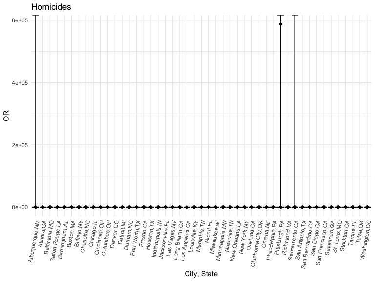

Homework 6
================
Mingee Choi
12/1/2022

# Problem 2

Create city_state variable and binary variable indicating whether
homicide is solved. Omit certain cities and Tulsa, AL. Limit analysis
for whom victim_race is white or black. Make sure victim_age is numeric.

``` r
homicide_data=
  read_csv("./data/homicide-data.csv")%>%
  janitor::clean_names()%>%
  mutate(reported_date = lubridate::ymd(reported_date))%>%
  drop_na(reported_date)
```

    ## Rows: 52179 Columns: 12
    ## ── Column specification ────────────────────────────────────────────────────────
    ## Delimiter: ","
    ## chr (9): uid, victim_last, victim_first, victim_race, victim_age, victim_sex...
    ## dbl (3): reported_date, lat, lon
    ## 
    ## ℹ Use `spec()` to retrieve the full column specification for this data.
    ## ℹ Specify the column types or set `show_col_types = FALSE` to quiet this message.

``` r
homicide_df=
homicide_data%>%
  mutate(city_state= str_c(city, state, sep=",")
  )%>%
  select(uid,city_state,everything())%>%
  group_by(city_state)%>%
  mutate(solved = case_when(disposition == "Closed by arrest" ~ 1,
                            disposition ==  "Closed without arrest" ~ 0,
                            disposition == "Open/No arrest" ~ 0),
         victim_age = as.numeric(victim_age),
         victim_race = as.factor(victim_race)) %>% 
  filter(city_state != "Dallas,TX", 
         city_state != "Phoenix,AZ", 
         city_state != "Kansas City,MO",
         city_state != "Tulsa,AL",
         victim_race %in% c("Black", "White")) %>% 
  select(city_state, solved, victim_age, victim_race, victim_sex)

homicide_df
```

    ## # A tibble: 39,692 × 5
    ## # Groups:   city_state [47]
    ##    city_state     solved victim_age victim_race victim_sex
    ##    <chr>           <dbl>      <dbl> <fct>       <chr>     
    ##  1 Albuquerque,NM      0         15 White       Female    
    ##  2 Albuquerque,NM      0         72 White       Female    
    ##  3 Albuquerque,NM      0         91 White       Female    
    ##  4 Albuquerque,NM      0         56 White       Male      
    ##  5 Albuquerque,NM      0         NA White       Male      
    ##  6 Albuquerque,NM      1         43 White       Female    
    ##  7 Albuquerque,NM      1         52 White       Male      
    ##  8 Albuquerque,NM      1         22 White       Female    
    ##  9 Albuquerque,NM      1         15 Black       Male      
    ## 10 Albuquerque,NM      1         25 Black       Male      
    ## # … with 39,682 more rows

Fit logistic regression with resolved vs unresolved as outcome and
victim and age, sex, and race, as predictors.Save glm as R object.

``` r
baltimore_df =
  homicide_df %>% 
  filter(city_state == "Baltimore,MD")

baltimore_glm=
  baltimore_df%>%
  glm(solved ~ victim_age + victim_race + victim_sex, data = ., family = binomial()) 

save(baltimore_glm, file="baltimore_glm.RData")
```

Apply broom: tidy to object and obtain estimate and confidence interval
of adjusted OR for solving homicides comparing male to female victims,
keeping all other variable fixed.

``` r
baltimore_glm%>%
 broom::tidy() %>% 
  mutate(OR = exp(estimate),
         lower_ci = exp(estimate - 1.96*std.error),
         upper_ci = exp(estimate + 1.96*std.error)) %>% 
  select(term, log_OR = estimate, OR, p.value, lower_ci, upper_ci) %>% 
  knitr::kable(digits = 3)
```

| term             | log_OR |    OR | p.value | lower_ci | upper_ci |
|:-----------------|-------:|------:|--------:|---------:|---------:|
| (Intercept)      |  0.310 | 1.363 |   0.070 |    0.975 |    1.907 |
| victim_age       | -0.007 | 0.993 |   0.043 |    0.987 |    1.000 |
| victim_raceWhite |  0.842 | 2.320 |   0.000 |    1.648 |    3.268 |
| victim_sexMale   | -0.854 | 0.426 |   0.000 |    0.325 |    0.558 |

Run glm for each cities in dataset and extract adjusted OR and CI for
solving homicides comparing male to female victims. Unnest.

``` r
cities_glm=
  homicide_df%>%
  nest(data = -city_state) %>%
  mutate( 
    models = map(.x = data, ~glm(solved ~ victim_age + victim_sex + victim_race, data = .x, family = binomial())), 
    results = map(models, broom::tidy)) %>%  
  select(city_state, results) %>% 
  unnest(results) %>%
  mutate(OR = exp(estimate),
         lower_ci = exp(estimate - 1.96*std.error),
         upper_ci = exp(estimate + 1.96*std.error)) %>%
  select(city_state, term, OR, lower_ci, upper_ci)

cities_glm
```

    ## # A tibble: 193 × 5
    ## # Groups:   city_state [47]
    ##    city_state     term                       OR lower_ci upper_ci
    ##    <chr>          <chr>                   <dbl>    <dbl>    <dbl>
    ##  1 Albuquerque,NM (Intercept)       1.84           0.534    6.37 
    ##  2 Albuquerque,NM victim_age        0.981          0.963    0.998
    ##  3 Albuquerque,NM victim_sexMale    1.77           0.831    3.76 
    ##  4 Albuquerque,NM victim_sexUnknown 0.000000471    0      Inf    
    ##  5 Albuquerque,NM victim_raceWhite  1.51           0.668    3.41 
    ##  6 Atlanta,GA     (Intercept)       2.39           1.49     3.83 
    ##  7 Atlanta,GA     victim_age        0.988          0.979    0.997
    ##  8 Atlanta,GA     victim_sexMale    1.00           0.684    1.46 
    ##  9 Atlanta,GA     victim_raceWhite  1.31           0.749    2.28 
    ## 10 Baltimore,MD   (Intercept)       1.36           0.975    1.91 
    ## # … with 183 more rows

Plot that shows estimated ORs and CIs for each city.

``` r
cities_glm%>%
  mutate(city_state = fct_reorder(city_state, OR)) %>% 
  ggplot(aes(x = city_state, y = OR)) +
  geom_point() + 
  geom_errorbar(aes(ymin = lower_ci, ymax = upper_ci)) +
  
  labs(y = "OR", x = "City, State",title = "Homicides")+
   theme(axis.text.x = element_text(angle = 80, hjust = 1))
```



# Problem 3
