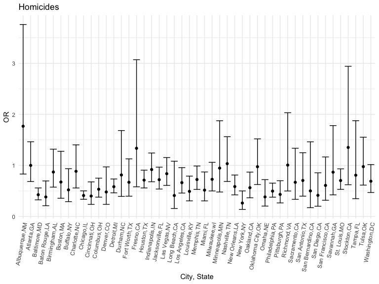

Homework 6
================
Mingee Choi
12/1/2022

# Problem 2

Create city_state variable and binary variable indicating whether
homicide is solved. Omit certain cities and Tulsa, AL. Limit analysis
for whom victim_race is white or black. Make sure victim_age is numeric.

``` r
homicide_data=
  read_csv("./data/homicide-data.csv")%>%
  janitor::clean_names()%>%
  mutate(reported_date = lubridate::ymd(reported_date))%>%
  drop_na(reported_date)
```

    ## Rows: 52179 Columns: 12
    ## ── Column specification ────────────────────────────────────────────────────────
    ## Delimiter: ","
    ## chr (9): uid, victim_last, victim_first, victim_race, victim_age, victim_sex...
    ## dbl (3): reported_date, lat, lon
    ## 
    ## ℹ Use `spec()` to retrieve the full column specification for this data.
    ## ℹ Specify the column types or set `show_col_types = FALSE` to quiet this message.

``` r
homicide_df=
homicide_data%>%
  mutate(city_state= str_c(city, state, sep=",")
  )%>%
  select(uid,city_state,everything())%>%
  group_by(city_state)%>%
  mutate(solved = case_when(disposition == "Closed by arrest" ~ 1,
                            disposition ==  "Closed without arrest" ~ 0,
                            disposition == "Open/No arrest" ~ 0),
         victim_age = as.numeric(victim_age),
         victim_race = as.factor(victim_race)) %>% 
  filter(city_state != "Dallas,TX", 
         city_state != "Phoenix,AZ", 
         city_state != "Kansas City,MO",
         city_state != "Tulsa,AL",
         victim_race %in% c("Black", "White")) %>% 
  select(city_state, solved, victim_age, victim_race, victim_sex)

homicide_df
```

    ## # A tibble: 39,692 × 5
    ## # Groups:   city_state [47]
    ##    city_state     solved victim_age victim_race victim_sex
    ##    <chr>           <dbl>      <dbl> <fct>       <chr>     
    ##  1 Albuquerque,NM      0         15 White       Female    
    ##  2 Albuquerque,NM      0         72 White       Female    
    ##  3 Albuquerque,NM      0         91 White       Female    
    ##  4 Albuquerque,NM      0         56 White       Male      
    ##  5 Albuquerque,NM      0         NA White       Male      
    ##  6 Albuquerque,NM      1         43 White       Female    
    ##  7 Albuquerque,NM      1         52 White       Male      
    ##  8 Albuquerque,NM      1         22 White       Female    
    ##  9 Albuquerque,NM      1         15 Black       Male      
    ## 10 Albuquerque,NM      1         25 Black       Male      
    ## # … with 39,682 more rows

Fit logistic regression with resolved vs unresolved as outcome and
victim and age, sex, and race, as predictors.Save glm as R object.

``` r
baltimore_df =
  homicide_df %>% 
  filter(city_state == "Baltimore,MD")

baltimore_glm=
  baltimore_df%>%
  glm(solved ~ victim_age + victim_race + victim_sex, data = ., family = binomial()) 

save(baltimore_glm, file="baltimore_glm.RData")
```

Apply broom: tidy to object and obtain estimate and confidence interval
of adjusted OR for solving homicides comparing male to female victims,
keeping all other variable fixed.

``` r
baltimore_glm%>%
 broom::tidy() %>% 
  mutate(OR = exp(estimate),
         lower_ci = exp(estimate - 1.96*std.error),
         upper_ci = exp(estimate + 1.96*std.error)) %>% 
  select(term, log_OR = estimate, OR, p.value, lower_ci, upper_ci) %>% 
  knitr::kable(digits = 3)
```

| term             | log_OR |    OR | p.value | lower_ci | upper_ci |
|:-----------------|-------:|------:|--------:|---------:|---------:|
| (Intercept)      |  0.310 | 1.363 |   0.070 |    0.975 |    1.907 |
| victim_age       | -0.007 | 0.993 |   0.043 |    0.987 |    1.000 |
| victim_raceWhite |  0.842 | 2.320 |   0.000 |    1.648 |    3.268 |
| victim_sexMale   | -0.854 | 0.426 |   0.000 |    0.325 |    0.558 |

Run glm for each cities in dataset and extract adjusted OR and CI for
solving homicides comparing male to female victims. Unnest.

``` r
cities_glm=
  homicide_df%>%
  nest(data = -city_state) %>%
  mutate( 
    models = map(.x = data, ~glm(solved ~ victim_age + victim_sex + victim_race, data = .x, family = binomial())), 
    results = map(models, broom::tidy)) %>%  
  select(city_state, results) %>% 
  unnest(results) %>%
  mutate(OR = exp(estimate),
         lower_ci = exp(estimate - 1.96*std.error),
         upper_ci = exp(estimate + 1.96*std.error)) %>%
  select(city_state, term, OR, lower_ci, upper_ci)

cities_glm
```

    ## # A tibble: 193 × 5
    ## # Groups:   city_state [47]
    ##    city_state     term                       OR lower_ci upper_ci
    ##    <chr>          <chr>                   <dbl>    <dbl>    <dbl>
    ##  1 Albuquerque,NM (Intercept)       1.84           0.534    6.37 
    ##  2 Albuquerque,NM victim_age        0.981          0.963    0.998
    ##  3 Albuquerque,NM victim_sexMale    1.77           0.831    3.76 
    ##  4 Albuquerque,NM victim_sexUnknown 0.000000471    0      Inf    
    ##  5 Albuquerque,NM victim_raceWhite  1.51           0.668    3.41 
    ##  6 Atlanta,GA     (Intercept)       2.39           1.49     3.83 
    ##  7 Atlanta,GA     victim_age        0.988          0.979    0.997
    ##  8 Atlanta,GA     victim_sexMale    1.00           0.684    1.46 
    ##  9 Atlanta,GA     victim_raceWhite  1.31           0.749    2.28 
    ## 10 Baltimore,MD   (Intercept)       1.36           0.975    1.91 
    ## # … with 183 more rows

Plot that shows estimated ORs and CIs for each city.

``` r
cities_glm%>%
  filter(term == "victim_sexMale")%>%
  mutate(city_state = fct_reorder(city_state, OR)) %>% 
  ggplot(aes(x = city_state, y = OR)) +
  geom_point() + 
  geom_errorbar(aes(ymin = lower_ci, ymax = upper_ci)) +
  labs(y = "OR", x = "City, State",title = "Homicides")+
   theme(axis.text.x = element_text(angle = 80, hjust = 1))
```


In most states, the odds that the homicide will remain solved for cases
where the victim is male is lower than the odds that the homicide will
remain solved for cases where the victim is female (ex: Chicago,
Cincinnati, Detroit)

# Problem 3

Load and clean data for regression analysis

``` r
birthweight_data =
  read_csv("./data/birthweight.csv") %>% 
  drop_na() %>% 
  janitor::clean_names()
```

    ## Rows: 4342 Columns: 20
    ## ── Column specification ────────────────────────────────────────────────────────
    ## Delimiter: ","
    ## dbl (20): babysex, bhead, blength, bwt, delwt, fincome, frace, gaweeks, malf...
    ## 
    ## ℹ Use `spec()` to retrieve the full column specification for this data.
    ## ℹ Specify the column types or set `show_col_types = FALSE` to quiet this message.

``` r
#checking datatype
  str(birthweight_data)
```

    ## tibble [4,342 × 20] (S3: tbl_df/tbl/data.frame)
    ##  $ babysex : num [1:4342] 2 1 2 1 2 1 2 2 1 1 ...
    ##  $ bhead   : num [1:4342] 34 34 36 34 34 33 33 33 36 33 ...
    ##  $ blength : num [1:4342] 51 48 50 52 52 52 46 49 52 50 ...
    ##  $ bwt     : num [1:4342] 3629 3062 3345 3062 3374 ...
    ##  $ delwt   : num [1:4342] 177 156 148 157 156 129 126 140 146 169 ...
    ##  $ fincome : num [1:4342] 35 65 85 55 5 55 96 5 85 75 ...
    ##  $ frace   : num [1:4342] 1 2 1 1 1 1 2 1 1 2 ...
    ##  $ gaweeks : num [1:4342] 39.9 25.9 39.9 40 41.6 ...
    ##  $ malform : num [1:4342] 0 0 0 0 0 0 0 0 0 0 ...
    ##  $ menarche: num [1:4342] 13 14 12 14 13 12 14 12 11 12 ...
    ##  $ mheight : num [1:4342] 63 65 64 64 66 66 72 62 61 64 ...
    ##  $ momage  : num [1:4342] 36 25 29 18 20 23 29 19 13 19 ...
    ##  $ mrace   : num [1:4342] 1 2 1 1 1 1 2 1 1 2 ...
    ##  $ parity  : num [1:4342] 3 0 0 0 0 0 0 0 0 0 ...
    ##  $ pnumlbw : num [1:4342] 0 0 0 0 0 0 0 0 0 0 ...
    ##  $ pnumsga : num [1:4342] 0 0 0 0 0 0 0 0 0 0 ...
    ##  $ ppbmi   : num [1:4342] 26.3 21.3 23.6 21.8 21 ...
    ##  $ ppwt    : num [1:4342] 148 128 137 127 130 115 105 119 105 145 ...
    ##  $ smoken  : num [1:4342] 0 0 1 10 1 0 0 0 0 4 ...
    ##  $ wtgain  : num [1:4342] 29 28 11 30 26 14 21 21 41 24 ...

``` r
birthweight_df =
  birthweight_data%>%
  mutate(
    babysex = as.factor(babysex),
    malform = as.factor(malform),
    frace = as.factor(frace),
    frace = recode_factor(frace,
                      "1" = "White",
                      "2" = "Black",
                      "3" = "Asian",
                      "4" = "Puerto Rican",
                      "8" = "Other"),
    mrace = as.factor(mrace),
    mrace = recode_factor(mrace,
                      "1" = "White",
                      "2" = "Black",
                      "3" = "Asian",
                      "4" = "Puerto Rican",
                      "8" = "Other")
  )%>%
  select(bwt,everything())
```

Propose regression model for birthweight

``` r
#I excluded pnumlbw and pnumgsa because they have 0 observations, malform and parity because they have low cell count, and ppbmi because I can use ppwt instead.
everything_model = 
  lm(
    bwt ~ babysex + bhead + blength + delwt+ fincome+frace + gaweeks + menarche+ mheight + momage + mrace + smoken + ppwt + wtgain,
    data = birthweight_df
  )

#Summary table to see which covariates have p<0.05
summary(everything_model) %>% 
  broom::tidy() %>% 
  mutate(
    p_value = format.pval(p.value, digits = 3, eps = 0.05)
  ) %>% 
  select(-p.value) %>%
  arrange(p_value) %>% 
  knitr::kable()
```

| term              |      estimate |   std.error |   statistic | p_value |
|:------------------|--------------:|------------:|------------:|:--------|
| (Intercept)       | -6068.4938166 | 140.3723468 | -43.2314053 | \<0.05  |
| babysex2          |    29.2645106 |   8.4628109 |   3.4580131 | \<0.05  |
| bhead             |   130.9601419 |   3.4511959 |  37.9463077 | \<0.05  |
| blength           |    74.8904878 |   2.0218359 |  37.0408333 | \<0.05  |
| delwt             |     4.1290227 |   0.3945230 |  10.4658608 | \<0.05  |
| gaweeks           |    11.2616326 |   1.4607821 |   7.7093174 | \<0.05  |
| mheight           |     6.7694335 |   1.8011410 |   3.7584140 | \<0.05  |
| mraceBlack        |  -151.4204451 |  46.0578137 |  -3.2876169 | \<0.05  |
| smoken            |    -4.8595918 |   0.5870310 |  -8.2782538 | \<0.05  |
| ppwt              |    -2.7526850 |   0.4327297 |  -6.3612108 | \<0.05  |
| fincome           |     0.2752995 |   0.1794096 |   1.5344741 | 0.125   |
| mraceAsian        |   -92.7619838 |  71.9112209 |  -1.2899515 | 0.197   |
| mracePuerto Rican |   -56.8242317 |  45.1481728 |  -1.2586164 | 0.208   |
| menarche          |    -3.5277645 |   2.8946601 |  -1.2187146 | 0.223   |
| fracePuerto Rican |   -47.4657670 |  44.6901576 |  -1.0621078 | 0.288   |
| momage            |     0.9797015 |   1.2187607 |   0.8038506 | 0.422   |
| fraceBlack        |    14.4417524 |  46.1610351 |   0.3128559 | 0.754   |
| fraceAsian        |    20.4717867 |  69.3152552 |   0.2953432 | 0.768   |
| fraceOther        |     4.3848564 |  74.0865307 |   0.0591856 | 0.953   |
